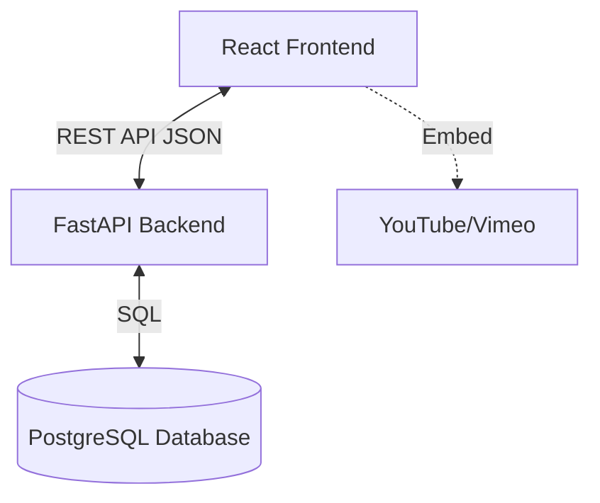

# Learning Tracker System Architecture

## 1. High-Level System Architecture

The application follows a standard **Client-Server Architecture**.

*   **Frontend (Generic User & Admin)**: A Single Page Application (SPA) built with **React** (using Vite). It handles the UI, user interactions, and communicates with the backend via RESTful APIs.
*   **Backend API**: Built with **Python FastAPI**. It serves as the bridge between the frontend and the database, handling business logic, authentication, and data processing.
*   **Database**: **PostgreSQL** (Managed) is used for persistent storage of users, courses, progress, and other relational data.
*   **Video Content**: Videos are **not** hosted on our server. We store embed URLs (YouTube/Vimeo) and the frontend renders them using an iframe/embedded player.

### Diagram


---

## 2. Frontend Component Structure (React)

The frontend is organized to separate presentational components from page logic and state management.

```text
/src
├── /assets          # Images, global styles
├── /components      # Reusable UI components
│   ├── /common      # Generic atoms (Button, Input, Card, Modal)
│   ├── /layout      # Layout shell (Navbar, Sidebar, Footer)
│   ├── /video       # VideoPlayer component
│   └── /quiz        # QuizTaker, QuizBuilder components
├── /context         # React Context for global state
│   └── AuthContext.jsx  # Handles user login state & role
├── /hooks           # Custom hooks (useAuth, useCourseProgress)
├── /pages           # Main view pages
│   ├── Login.jsx
│   ├── Dashboard.jsx        # Learner dashboard
│   ├── CourseDetails.jsx    # Video player & notes view
│   ├── AdminDashboard.jsx   # Analytics overview
│   └── AdminCourseMan.jsx   # Course creation/editing
├── /services        # API service layer
│   └── api.js       # Axios instance with interceptors
└── App.jsx          # Routes definition
```

---

## 3. Backend API Architecture (FastAPI)

The backend is structured for scalability and maintainability, separating concerns clearly.

```text
/app
├── main.py              # Application entry point, CORS setup
├── /api
│   └── /v1              # API Versioning
│       ├── /auth.py     # Login, Registration (Admin only)
│       ├── /users.py    # User management
│       ├── /courses.py  # CRUD for courses (Admin) + View (Learner)
│       └── /progress.py # Progress tracking & Quiz submissions
├── /core
│   ├── config.py        # Environment variables (DB_URL, SECRET_KEY)
│   └── security.py      # JWT handling, Password hashing
├── /db
│   ├── session.py       # Database connection setup
│   └── base.py          # SQLAlchemy base model
├── /models              # SQLAlchemy ORM Models (Tables)
├── /schemas             # Pydantic Models (Request/Response Validation)
└── /crud                # Database CRUD operations
```

---

## 4. Database Schema (PostgreSQL)

We use a relational schema to track users, courses, and their interactions accurately.

### Tables

**1. `users`**
*   `id`: Primary Key, Integer, Auto-increment
*   `email`: String, Unique (Username)
*   `hashed_password`: String
*   `full_name`: String
*   `role`: Enum ('admin', 'learner')
*   `is_active`: Boolean

**2. `courses`**
*   `id`: Primary Key, Integer
*   `title`: String
*   `description`: Text
*   `video_url`: String (YouTube/Vimeo link)
*   `created_at`: Timestamp
*   `created_by_id`: Foreign Key -> users.id

**3. `enrollments`** (Assignments)
*   `id`: Primary Key
*   `user_id`: Foreign Key -> users.id
*   `course_id`: Foreign Key -> courses.id
*   `assigned_at`: Timestamp
*   *This table links Learners to Courses.*

**4. `progress`**
*   `id`: Primary Key
*   `user_id`: Foreign Key -> users.id
*   `course_id`: Foreign Key -> courses.id
*   `is_completed`: Boolean
*   `last_watched_timestamp`: Float (Seconds)
*   `quiz_score`: Integer (Nullable)
*   `notes`: Text (Nullable, for learner notes)
*   `updated_at`: Timestamp

---

## 5. Authentication Flow (JWT)

We use JSON Web Tokens (JWT) for stateless authentication.

1.  **Login**:
    *   Client posts `username` (email) and `password` to `/api/v1/auth/login`.
    *   Backend verifies credentials.
    *   If valid, Backend generates an `access_token` (expires in e.g., 30 min) containing `sub` (user_id) and `role`.
    *   Backend returns `{ access_token: "...", token_type: "bearer" }`.

2.  **Authenticated Requests**:
    *   Client stores the token (e.g., in localStorage or memory).
    *   For every request to protected routes, Client sends header: `Authorization: Bearer <token>`.

3.  **Role-Based Access Control (RBAC)**:
    *   Middleware checks the `role` in the token payload.
    *   If an Admin-only route (e.g., `POST /courses`) is accessed by a Learner, Backend returns `403 Forbidden`.

---

## 6. Data Flow

### Example: Learner Watching a Course

1.  **Frontend**: User navigates to `/course/1`.
2.  **Frontend**: component (useEffect) calls `api.get('/courses/1')`.
3.  **Backend**: Receives request, validates JWT.
4.  **Backend**: Checks if User ID is enrolled in Course ID 1 (via `enrollments` table).
5.  **Backend**: Returns Course Data (Title, Video URL, Description).
6.  **Frontend**: Renders `VideoPlayer` component with the URL.
7.  **Frontend**: User types notes. Frontend sends `PUT /progress/1` with `{ notes: "..." }`.
8.  **Backend**: Updates the `progress` table for that user and course.
9.  **Database**: Commits changes.
10. **Frontend**: Displays "Saved" toast notification.

### Example: Admin Creating a Course

1.  **Frontend**: Admin fills form (Title, URL) and clicks "Create".
2.  **Frontend**: Sends `POST /courses` with payload.
3.  **Backend**: Validates JWT and checks if `role == 'admin'`.
4.  **Backend**: Creates new record in `courses` table.
5.  **Backend**: Returns the created course object.
6.  **Frontend**: Updates the list of courses immediately.
